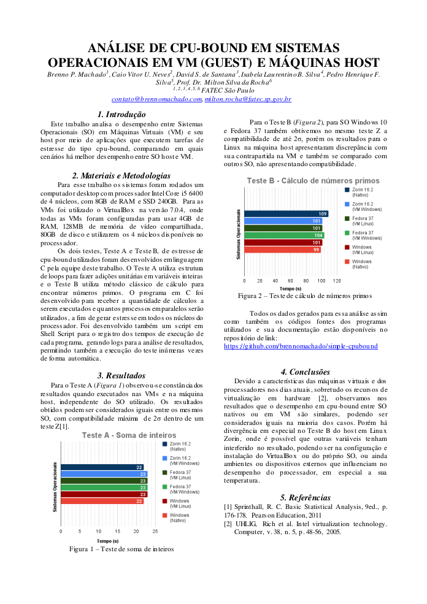

### Simple CPU-Bound
---

Este é um simples execútavel para gerar CPU bound em sistemas Linux desenvolvido como parte de um trabalho da disciplina de Laboratório de Hardware (IHW-100) da FATEC São Paulo.


#### Compilação e execução
- ##### Baixando e compilando:
    ```
    git clone https://github.com/brennomachado/simple-cpubound.git

    gcc -Wall cpu-bound -o cpu-teste
    ```

- ##### Usando o script:
    ```
    chomd +x ./script.sh
    ./scrip.sh
    ```

- ##### Parâmetros obrigatórios:
    -i: Número inteiro para executar bilhoões de execuções.
    -p: Número inteiro para representar quantos processos serão abertos para cada teste.
    -t: Caracter "A" ou "B" para selecionar Teste A ou Teste B.

- ##### Parâmetros opcionais:
    -v: Número inteiro que define quantas vezes o teste será repetido.


---
### Os testes

#### Teste A: https://youtu.be/7fHDZOjR31c (1min)
- Parâmetros usados para o artigo:
    ```
    ./script.h -i 10 -p 4 -t A -v 50
    ```
- Video mostrando exemplo de execução do Teste A:
    <p align="center">
    <a href="http://www.youtube.com/watch?feature=player_embedded&v=7fHDZOjR31c" target="_blank"></a>
    </p>

#### Teste B: https://youtu.be/MvucFKVSUwg (4min 49s)

- Parâmetros usados par ao artigo :
    ```
    ./script.h -i 1 -p 4 -t B -v 30
    ```
- Video mostrando exemplo de execução do Teste A:
    <p align="center">
    <a href="http://www.youtube.com/watch?feature=player_embedded&v=7fHDZOjR31c" target="_blank"></a>
    </p>

---
### O artigo entregue
Para o artigo entregue foi utilizado os seguintes parâmetros para cada teste: 

- Pasta com os arquivos de resultados gerados: <a href="https://github.com/brennomachado/simple-cpubound/tree/main/resultados/pc02-desktop" target="_blank"> aqui</a>
- A análise de dados feita: <a href="/resultados/Resultados-Desktop.ods" target="_blank">Planilha aqui</a>

- Obs: Para execução em ambientes Windows foi utilizado o <a href="https://cygwin.com/index.html" target="_blank">CygWin</a> com a instalação das bibliotecas `gcc-core` e `gcc-g++`.

<a href="artigo-resumo.pdf" target="_blank">Este foi o artigo</a> entregue:

<p align="center">
<a href="artigo-resumo.pdf" target="_blank">
</a>
</p>


